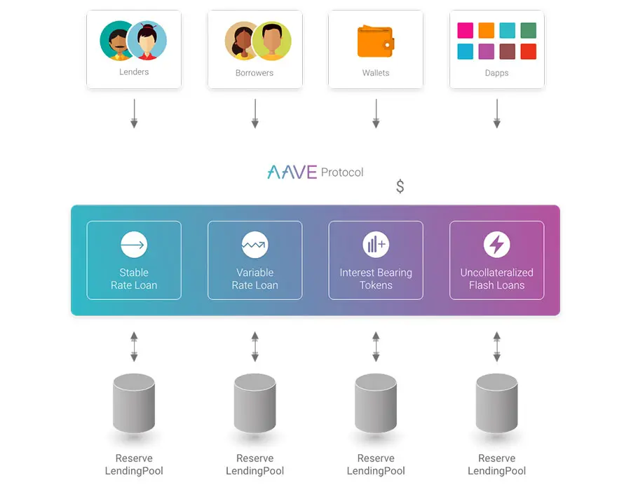

# FinTech Case Study - Aave

## Overview and Origin

* **Aave**, formerly **Ethlend**

* Aave was created in 2017, at the time it was aptly named Ethlend.

* The founder and CEO of Aave is a Finnish law-school graduate named Stani Kulechov. The company is based in London with another office in Switzerland.

* Stani was studying law at the Helsinki university in 2015 when he got interested in the Ethereum network. Stani was intrigued by Ethereum and begun exploring how it could help to disrupt the traditional finance system. Stani saw tremendous potential in the power of Ethereum based smart contracts.

* In 2017 Stani launched Ethlend the product, along with the LEND token in the form of an ICO, to further fund the development of Ethlend.  **REBRAND**

## Business Activities:

* Aave is an overcollateralised lending protocol ran on the Ethereum network. Aave is disrupting traditional finance by allowing users to earn interest on their crypto deposits and inversely, allowing users to borrow against their crypto assets while paying relatively low interest rates. 
---
All while only interacting with an autonomous protocol, below is a diagram of how the protocol works.

* Aave's target customer base is to take loan potential away from the big banks and other legacy financial systems, appealing to individuals already in the crypto space who would otherwise take these traditional routes.  The AAVE token currently has 78,292 wallet addresses holding the token at the time of writing. Market size of the customer base for the lending protocol is hard to find but one metric they do offer is total value locked (TVL). Aave's TVL currently sits at $18b USD. The protocol has seen an astronomical increase in TVL since its launch on the Ethereum mainnet in 2020, rising from $40m in April 2020 to where it currently sits now at almost $19b. That's a 47,500% increase in just over a year. To me this is a huge vote of confidence for Aave and for the future of decentralised finance as a whole.

* Aave, apart from being the first DeFi lending protocol, has a few other advantages over its competitors; it was the first protocol to offer flash loans. Flash loans are zero collateral loans where users can borrow an amount of cryptocurrency while putting up no collateral, the catch is the loan must be paid back by the time the next Ethereum block has been mined (currently 12 seconds). The main uses of flash loans are arbitrage opportunities and the swapping of collateral used for a current loan. Aave also offers the largest range of coins to lend and borrow compared to its competitors as well as fixed and variable interest rates, the ability to swap between them and the smallest loan to collateral ratio. On some coins you can borrow up to 80% of the collateral deposited.

* Aave uses the Ethereum blockchain to run the protocol and they use smart contracts to facilitate the loans and flash loans as well as almost every other feature offered on the app, even down to determining the interest rates. Aave's tokenomics or aavenomics are aimed at making the protocol more decentralised, through governance from token holders. Part of their aavenomics includes their safety module. Users are incentivised by redistribution of the protocols fee's to lock their tokens in the safety module (SM). The safety module acts as a safety net in the case of a shortfall. In the case of a shortfall, tokens will be taken out of the SM and sold on the open market to pay back the temporary 'loss' incurred by users of the protocol. It really is an ingenious method.

## Landscape:

* Aave has implemented DeFi lending as opposed to the traditional lending methods of legacy based finance.

* DeFi is a relatively new domain with the first DeFi lending protocols being deployed in 2017. That being said, there have been new trends and improvements to the features for users such as flash loans.

* Aave's major competitors are Compound, MakerDao, and InstaDApp; all of which serve relatively the same function, the variance coming from different interest rates, range of coins, user-friendlyness and flash loans. Right now, the only other protocol that offers flash loans is InstaDApp.

## Results

* With 78,000 holders and US$19b in TVL, Aave has managed huge growth in the last 4 years, but this is still only a fraction of the global bond market which currently sits at US$128T; putting Aave's total global lending market share at less than 0.02%. Aave along with the other protocols are poised for more huge growth over the coming years as DeFi, blockchain and cryptocurrency as a whole become more mainstream.

* The core metric used to measure the success of DeFi lending protocols is the total value locked (TVL). This refers to the total amount of USD locked within the protocols liquidity, which is used to fund the loans. TVL can be a good way to measure interest in a DeFi project. Another measure of interest is the total wallet addresses, which for Aave currently sits around the 78,000 mark.

* I have found conflicting information on who is the overall king of DeFi lending. The DeFi pulse index puts Aave at number 2 in terms of TVl, whereas DeFi Llama ranks Aave number 1.

## Recommendations

* If I was to give a recommendation to Aave regarding new features, I would recommend to further lower the collateral needed to secure a loan by the use of oracles. An oracle is a way of putting real world information into the blockchain. For example, user's credit rating.

* Right now, traditional personal loans don't require collateral, they require a good credit score and a relatively high interest rate. For example, by lowering the collateral needed for a loan to 20%, and keeping interest rates relatively low, Aave could really tap into traditional lending's marketshare.

* This service would make use of oracles, because an oracle is a way of getting real world information like coin prices, a users credit rating or the weather on a certain day, into the blockchain.

* Oracles could greatly improve the amount of use cases that on-chain smart contracts have. Consider a simple bet via a smart contract; User A deposits $50 into a smart contract betting that Trump will win the election. User B deposits $50 into the same smart contract against User A, betting that Biden will win the election. For this bet to be facilitated, the chain needs to verify who actually won the election and this is where the oracle comes in. An oracle will incentivise users to vote on a certain outcome. Where 90% of users say that Biden won and the other 10% say that Trump won, the oracle will take the 90% as true, and penalise the other 10%. This incentivises users to put forward the correct knowledge and further facilitates the long-term validity of oracles.

---

* **References:**  

* https://docs.aave.com/aavenomics/ - Aave documents
* https://dyor-crypto.fandom.com/wiki/Aave_(AAVE) - Aave fandom wiki
* https://podcasts.google.com/search/aave%20the%20bad%20crypto%20podcast - Popular crypto podcast
* https://home.kpmg/us/en/home/insights/2018/09/2018-issue3-article3.html - Blockchain and the future of finance
* https://etherscan.io/token/0x7fc66500c84a76ad7e9c93437bfc5ac33e2ddae9 - AAVE token holders
* https://www.coinbureau.com/review/aave-lend/ - Review of Aave by a popular crypto youtuber
* https://albaronventures.com/defi-lending-aave-vs-maker-vs-compound/#:~:text=Compound%20has%20an%20average%20of,Aave%20has%20~%20100%2D150. - Albaron blog
* https://academy.binance.com/en/articles/blockchain-oracles-explained - Oracles explained by Binance
* https://defipulse.com/ - DeFi index
* https://defillama.com/protocols - DeFi index
